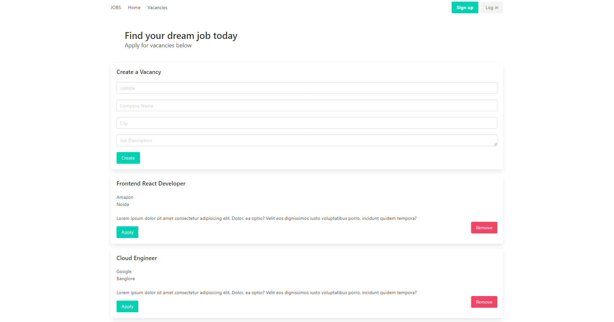

# Job Portal

Job portal is a web based single page application.
Where a user can find a job as well as a recruiter can post a vacancy too.


## Demo

https://jobportal-vue.netlify.app/


## Features

- Easy and Light weight
- Cross platform
- Single Page Application
- Fully Responsive
- Vacancies can be applied by the user
- Vacancies can be posted by the recruiter

## Screenshots




## Run Locally

Clone the project

```bash
  git clone https://github.com/badass1901/Job-Portal
```

Go to the project directory

```bash
  cd my-project
```

Install dependencies

```bash
  npm install
```

Start the server

```bash
  npm run start
```


## Installation

Install my-project with npm

```bash
  npm install job-portal
  cd job-portal
```
```bash
  yarn install job-portal
  cd job-portal
```
    
## Build

For production build run

```bash
npm run build
```
OR

```bash
yarn build
```


## Deployment

To deploy this project run

```bash
  npm run deploy
```
## 🛠 Tools
- Vue js
- Node


## Support

For support, email shashwatsagar19@gmail.com or visit https://shashwatsagar.netlify.app

